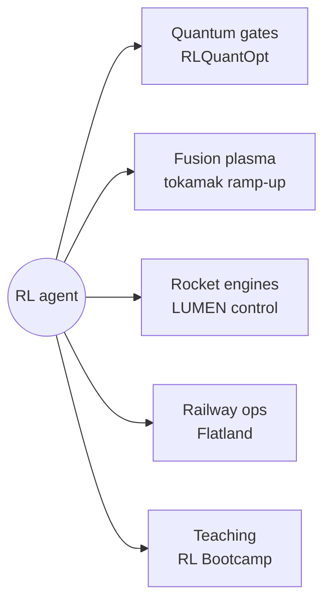
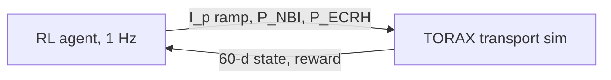
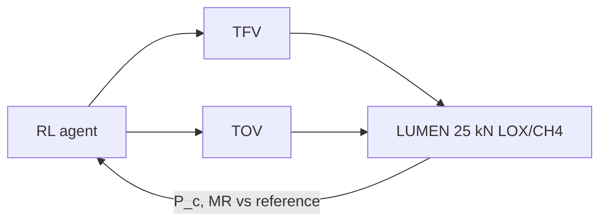
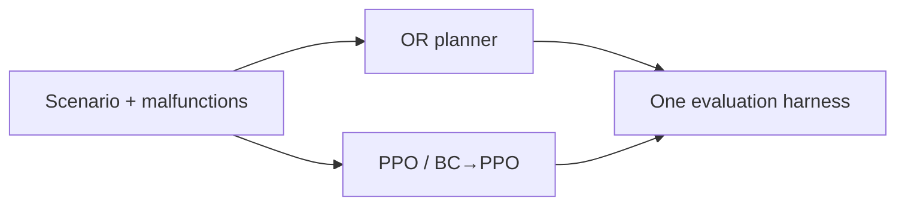
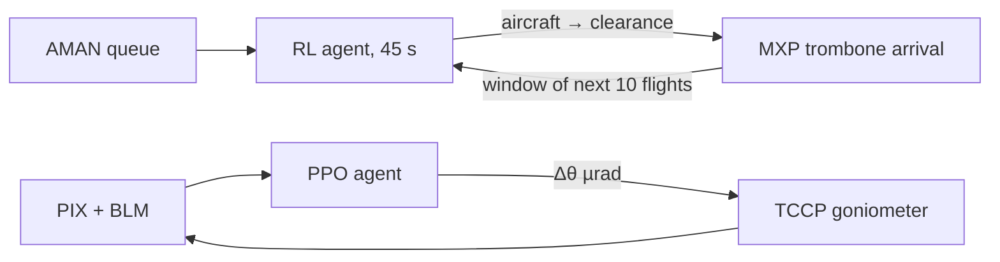

# lg-research

**Curated research portfolio of Leander Grech — reinforcement learning for physical control.**

🌐 **Live site: <https://leandergrech.github.io/lg-research/>** · [LinkedIn](https://www.linkedin.com/in/grechleander/)

## Projects

> The tokamak, rocket-engine and Flatland repositories are **preliminary**: their literature reviews and baseline code were generated with AI assistance (Claude) to scope each benchmark.

| Project | Domain | Status | Site | Code |
|---|---|---|---|---|
| **RLQuantOpt** — fast, robust perfect-entangling gates via RL | Quantum control | Published (QST 2026) · v2 active | [site](https://leandergrech.github.io/rlquantopt/) | [repo](https://github.com/leandergrech/rlquantopt) |
| **RL for tokamak current ramp-up** — Gym-TORAX ITER hybrid scenario | Fusion | Preliminary · AI-assisted scaffold | [site](https://leandergrech.github.io/rl-tokamak-rampup/) | [repo](https://github.com/leandergrech/rl-tokamak-rampup) |
| **RL for rocket engine control** — DLR LUMEN Control Challenge | Propulsion | Preliminary · AI-assisted scaffold | [site](https://leandergrech.github.io/rl-rocket-engine-control/) | [repo](https://github.com/leandergrech/rl-rocket-engine-control) |
| **RL for Flatland train rescheduling** — MARL vs operations research | Railways | Preliminary · AI-assisted scaffold | [site](https://leandergrech.github.io/rl-flatland-rescheduling/) | [repo](https://github.com/leandergrech/rl-flatland-rescheduling) |
| **RL Bootcamp — Participant Primer** | Teaching | Live handbook | [site](https://leandergrech.github.io/rl-bootcamp-setup-lg/) | [repo](https://github.com/leandergrech/rl-bootcamp-setup-lg) |

### RLQuantOpt

```mermaid
flowchart LR
    A[RL agent] -->|pulse Ω&#40;t&#41;| B[Two coupled transmons]
    B -->|calibration obs · fidelity reward| A
```

~10 ns perfect-entangling gate at the speed limit · ~100× faster JAX v2 simulation · [doi:10.1088/2058-9565/ae2c16](https://doi.org/10.1088/2058-9565/ae2c16)

### Tokamak current ramp-up

PI baseline 3.79 reproduced exactly · MBPO 3.95 after 1,364 simulator steps · reward exploit found, audited score proposed

### Rocket engine control

DLR's SAC controller: 1.3 % mean tracking error on the real engine · 7 benchmark cases

### Flatland rescheduling

100 trains on 100×100: OR 95.7 % arrival vs best RL 16.0 %

## Aviation & particle accelerators (code not public)

| Project | Domain | Status | Highlights |
|---|---|---|---|
| **TADA** — Terminal Airspace Digital Assistant: RL arrival sequencing at Milan Malpensa (trombone) and Bergamo (point merge) · [single-agent docs](https://leander-grech.github.io/tada-single-agent-docs/) | Air traffic control | Active · researcher · Best of Session, DASC 2026 | 92.7 % of flights within ±60 s of AMAN target · 63/100 twenty-flight streams solved · 3/100 with a loss of separation; on point merge, no loss of separation on feasible streams |
| **ASTRA** — en-route hotspot prediction (~1 h ahead) and RL resolution; I designed the prototype RL agent that paved the way for TADA | Air traffic control | Completed · TRL 2 | [Aerospace 2026](https://doi.org/10.3390/aerospace13010054) · [EASN 2025](https://doi.org/10.3390/engproc2025090091); real-time use still needs weather, knock-on effects and live integration |
| **AICRYSCON** — autonomous alignment of one bent crystal (TCCP) in TWOCRYST | CERN LHC | Beam-tested · paper submitted to EPJ-RI | PPO agent on a data-driven surrogate of beam-test data; replaces 2–4 h manual sweeps with 1–3 min recoveries |

## Earth observation & applied AI

- **Semablu** — Earth-observation startup: super-resolving free 10 m multispectral Sentinel-2 imagery ×4 for mapping farmland, towns, coastlines and seagrass. Unlike bicubic upsampling, which only interpolates existing pixels, super-resolution learns the fine detail behind a coarse pixel from paired low/high-resolution imagery. Clouds, shadows and other perturbations are detected per scene so noisy acquisitions still add coverage across all bands. [semablu.com](https://semablu.com/)
- **ADACE3** — receipt data extraction (University of Malta × PTL, MCST FUSION): multi-engine OCR + layout-aware transformer + rules; 0.98 F1. [Paper](https://doi.org/10.3390/make7040167)
- **VISTA · Polzify** — privacy-preserving analysis of visitor photos for destination management (Malta's beaches). Best Full Paper, IFITT ENTER 2026.
- **POLIRURAL · Horizon Europe** — three digital tools for Maltese farmers.

## Teaching

| Resource | Site | Code |
|---|---|---|
| **RL Bootcamp 2026 — Tutorial Handbook** (created & curated): fundamentals → Ant reality gap → design-your-own air-traffic MDP | [site](https://sarl-plus.github.io/RL_Bootcamp_2026_tutorial/) | [repo](https://github.com/SARL-PLUS/RL_Bootcamp_2026_tutorial) |
| **RL Bootcamp — Participant Primer** | [site](https://leandergrech.github.io/rl-bootcamp-setup-lg/) | [repo](https://github.com/leandergrech/rl-bootcamp-setup-lg) |
| **CCE5502** — Master's AI/ML course, University of Malta | | |

## Degrees & publications

- **PhD (University of Malta, 2022)** — *Renovation of the beam-based feedback systems in the LHC* · [PDF](https://www.um.edu.mt/library/oar/bitstream/123456789/104427/1/Leander%20Grech.pdf)
- **B.Sc. (Hons) Computer Engineering (University of Malta, 2017)** — *Collision avoidance system for the RP survey and visual inspection train in the CERN LHC* · [record](https://www.um.edu.mt/library/oar/handle/123456789/23489)

| Year | Publication | Venue |
|---|---|---|
| 2026 | Preliminary validation of a terminal airspace digital assistant through low-fidelity simulation | 45th DASC · Best of Session |
| 2026 | [A machine learning framework for predicting and resolving complex tactical air traffic events using historical data](https://doi.org/10.3390/aerospace13010054) | Aerospace |
| 2026 | [Analysing visual user-generated content for destination management](https://link.springer.com/book/9783032239242) | ENTER 2026 · Best Full Paper |
| 2026 | [Achieving fast and robust perfect entangling gates via reinforcement learning](https://doi.org/10.1088/2058-9565/ae2c16) | Quantum Sci. Technol. |
| sub. | Surrogate model driven RL optimization of the TWOCRYST crystal angular alignment | EPJ Research Instrumentation (submitted) |
| 2025 | [Receipt information extraction with joint multi-modal transformer and rule-based model](https://doi.org/10.3390/make7040167) | Mach. Learn. Knowl. Extr. |
| 2025 | [AI-enabled tactical FMP hotspot prediction and resolution (ASTRA)](https://doi.org/10.3390/engproc2025090091) | Eng. Proc. · EASN 2025 |
| 2022 | [Application of reinforcement learning in the LHC tune feedback](https://doi.org/10.3389/fphy.2022.929064) | Frontiers in Physics |
| 2021 | Renovation of the beam-based feedback controller in the LHC | ICALEPCS'21 |
| 2021 | [A machine learning approach for the tune estimation in the LHC](https://doi.org/10.3390/info12050197) | Information |
| 2020 | [An alternative processing algorithm for the tune measurement system in the LHC](https://cds.cern.ch/record/2772585) | IBIC'20 |
| 2019 | [Feasibility of hardware acceleration in the LHC orbit feedback controller](https://doi.org/10.18429/JACoW-ICALEPCS2019-MOPHA151) | ICALEPCS'19 |
| 2018 | [Collision avoidance system for the RP survey and visual inspection train in the CERN LHC](https://ieeexplore.ieee.org/document/8560485/) | IEEE CASE |

## Site

A single static `index.html` (no build step), served by GitHub Pages from `main`.
Five colour themes are built in and switchable from the header, with **Plasma** as the default: **Control Room**, **Transmon**, **Plasma**, **Limestone**, **Blueprint**.
