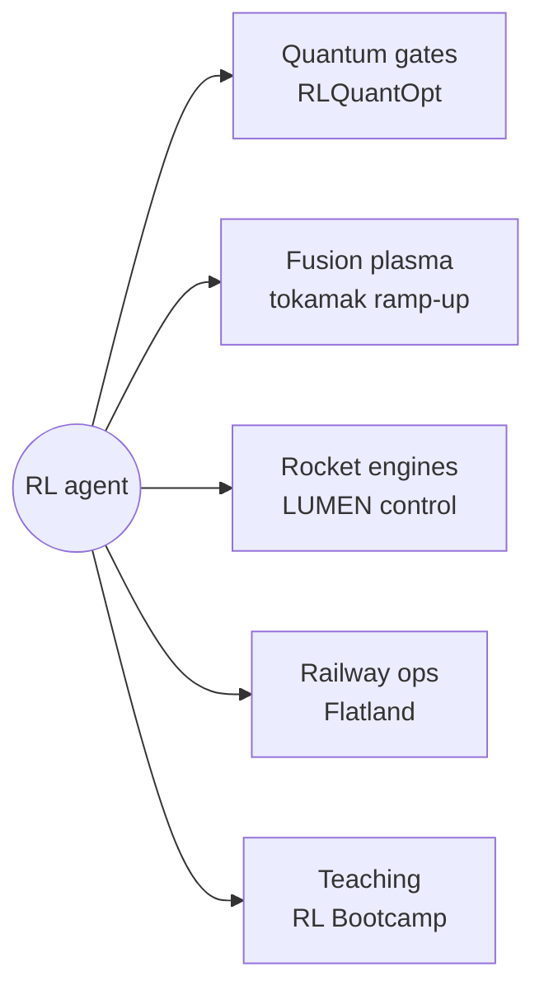
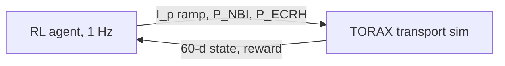
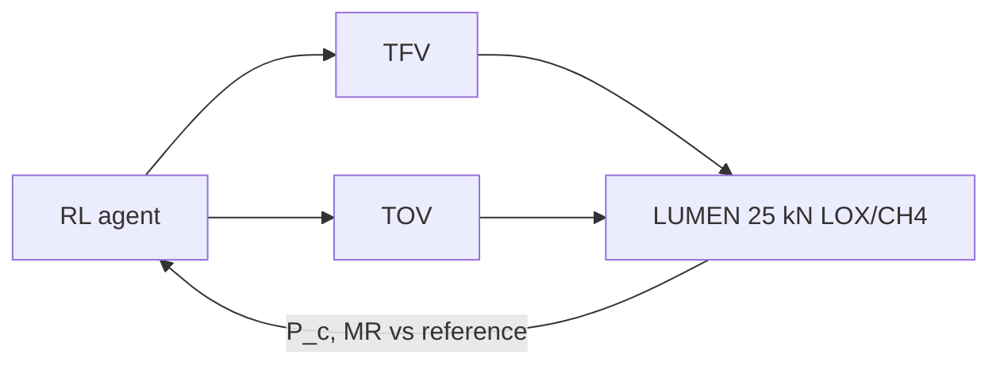
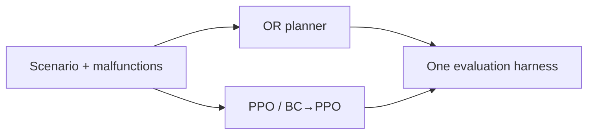
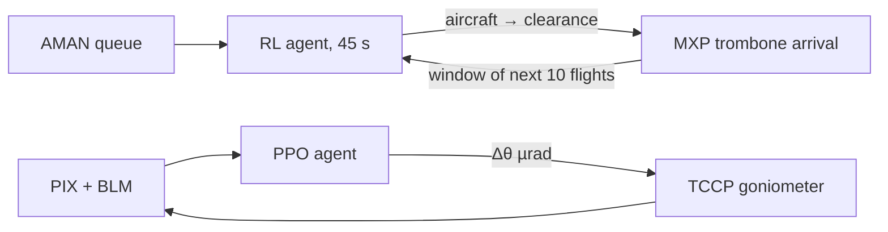

# lg-research

**Curated research portfolio of Leander Grech — reinforcement learning for physical control.**

🌐 **Live site: <https://leandergrech.github.io/lg-research/>**

## Projects

| Project | Domain | Status | Site | Code |
|---|---|---|---|---|
| **RLQuantOpt** — fast, robust perfect-entangling gates via RL | Quantum control | Published (QST 2026) · v2 active | [site](https://leandergrech.github.io/rlquantopt/) | [repo](https://github.com/leandergrech/rlquantopt) |
| **RL for tokamak current ramp-up** — Gym-TORAX ITER hybrid scenario | Fusion | Active | [site](https://leandergrech.github.io/rl-tokamak-rampup/) | [repo](https://github.com/leandergrech/rl-tokamak-rampup) |
| **RL for rocket engine control** — DLR LUMEN Control Challenge | Propulsion | Review done · awaiting simulator | [site](https://leandergrech.github.io/rl-rocket-engine-control/) | [repo](https://github.com/leandergrech/rl-rocket-engine-control) |
| **RL for Flatland train rescheduling** — MARL vs operations research | Railways | Active | [site](https://leandergrech.github.io/rl-flatland-rescheduling/) | [repo](https://github.com/leandergrech/rl-flatland-rescheduling) |
| **RL Bootcamp — Participant Primer** | Teaching | Live handbook | [site](https://leandergrech.github.io/rl-bootcamp-setup-lg/) | [repo](https://github.com/leandergrech/rl-bootcamp-setup-lg) |

### RLQuantOpt

```mermaid
flowchart LR
    A[RL agent] -->|pulse Ω&#40;t&#41;| B[Two coupled transmons]
    B -->|calibration obs · fidelity reward| A
```

~10 ns perfect-entangling gate at the speed limit · ~100× faster JAX v2 simulation · [doi:10.1088/2058-9565/ae2c16](https://doi.org/10.1088/2058-9565/ae2c16)

### Tokamak current ramp-up

PI baseline 3.79 reproduced exactly · MBPO 3.95 after 1,364 simulator steps · reward exploit found, audited score proposed

### Rocket engine control

DLR's SAC controller: 1.3 % mean tracking error on the real engine · 7 benchmark cases

### Flatland rescheduling

100 trains on 100×100: OR 95.7 % arrival vs best RL 16.0 %

## Aviation & particle accelerators (code not public)

| Project | Domain | Status | Highlights |
|---|---|---|---|
| **TADA** — RL arrival sequencing into Milan Malpensa | Air traffic control | Active · lead researcher | 92.7 % of flights within ±60 s of AMAN target · 63/100 twenty-flight streams solved · 3/100 with a loss of separation |
| **AICRYSCON** — autonomous crystal alignment for TWOCRYST | CERN LHC | Beam-tested · paper submitted to EPJ-RI | PPO agent on a data-driven surrogate of LHC beam-test data; replaces 2–4 h manual sweeps with 1–3 min recoveries |
| **RL in the LHC tune feedback** | CERN LHC | Published 2022 | [Frontiers in Physics, doi:10.3389/fphy.2022.929064](https://doi.org/10.3389/fphy.2022.929064) |

## Site

A single static `index.html` (no build step), served by GitHub Pages from `main`.
Five colour themes are built in and switchable from the header: **Control Room**, **Transmon**, **Plasma**, **Limestone**, **Blueprint**.
